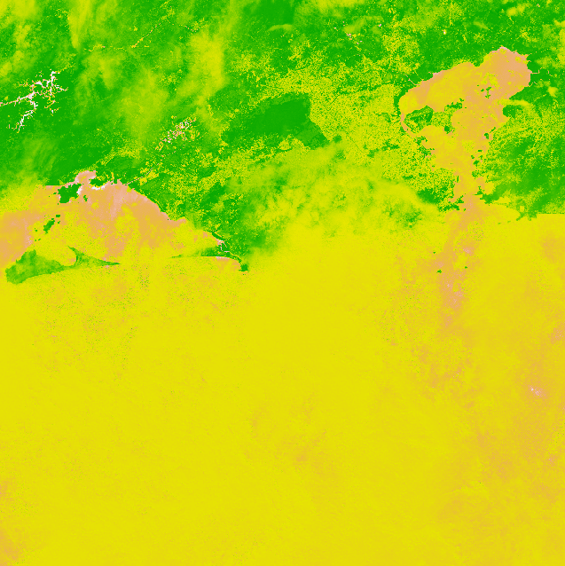

# rio-ndvi-automation
This script downloads Sentinel-2 L2A images from AWS STAC for the Rio de Janeiro (RJ) region, calculates the NDVI, and saves it as a .tif file.

RJ|Example



## Usage

```r
source("R/ndvi_sentinel.R")
main()


